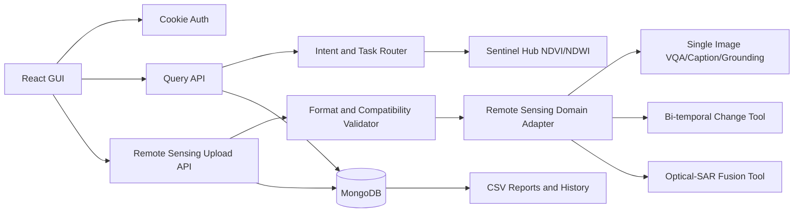

# SatQuery AI API and Use-Case Guide

SatQuery AI is an authenticated remote-sensing assistant. It accepts natural-language questions about regions and satellite observations, can run Sentinel Hub statistics for geocoded locations, supports uploaded single images and image pairs, stores query and analysis history, manages watched regions, and exports reports.

## 1. Problem Being Solved

Remote-sensing tools usually require users to understand sensors, spectral indices, GIS workflows, image formats, model selection, and change-detection parameters. SatQuery AI hides that complexity behind two interfaces:

1. **Explore:** Ask a natural-language question about a region or coordinate.
2. **Analysis Lab:** Upload a supported image or image pair and ask for VQA, captioning, grounding, change analysis, or optical-SAR analysis.

The backend validates the request, selects a workflow, executes the available specialist adapter, returns confidence and evidence, and stores the result for later history and reports.

## 2. Base URL and Authentication

Development base URL:

```text
http://localhost:3000/api
```

The frontend runs at `http://localhost:5173`.

Authentication uses two HTTP-only cookies:

```text
accessToken
refreshToken
```

The browser must send credentials on every API request. Axios is already configured with `withCredentials: true`.

Do not read these cookies from JavaScript and do not manually add a Bearer token. The backend reads the access cookie through `cookie-parser`.

Common authenticated request with cURL:

```bash
curl -i -c cookies.txt \
  -H "Content-Type: application/json" \
  -d '{"email":"analyst@example.com","password":"StrongPass1"}' \
  http://localhost:3000/api/auth/login

curl -b cookies.txt http://localhost:3000/api/auth/me
```

## 3. Standard Response Format

Successful responses generally use:

```json
{
  "success": true,
  "data": {}
}
```

Errors generally use:

```json
{
  "success": false,
  "message": "Readable error message"
}
```

Validation errors may also contain:

```json
{
  "success": false,
  "message": "Validation failed",
  "errors": ["...details..."]
}
```

## 4. Authentication APIs

### Register

```http
POST /api/auth/register
```

Public. Creates an analyst account and sets both authentication cookies.

Request:

```json
{
  "name": "Chetan Kumar",
  "email": "chetan@example.com",
  "password": "StrongPass1",
  "organisation": "SatQuery Research"
}
```

Rules:

- `name`: 2 to 80 characters
- `email`: valid email
- `password`: 8 to 128 characters, with uppercase, lowercase, and number
- `organisation`: optional, up to 120 characters
- `role` is ignored from public registration and defaults to `analyst`

### Login

```http
POST /api/auth/login
```

Public. Verifies credentials, applies failed-login lockout rules, and sets new cookies.

```json
{
  "email": "chetan@example.com",
  "password": "StrongPass1"
}
```

### Current User

```http
GET /api/auth/me
```

Private. Validates the access cookie and returns the current user.

### Refresh Session

```http
POST /api/auth/refresh
```

Public route with a valid `refreshToken` cookie. Rotates the access cookie.

No request body is needed:

```json
{}
```

The backend also accepts a `refreshToken` body for compatibility with older clients, but cookie authentication is the supported flow.

### Logout

```http
POST /api/auth/logout
```

Private. Clears both cookies, removes the stored refresh-token hash, and blocklists the current access-token ID when Redis is configured.

## 5. Natural-Language Explore APIs

### Submit Query

```http
POST /api/query
```

Private. Accepts one natural-language question and saves the result in query history.

Request:

```json
{
  "rawQueryText": "Show me flood conditions around 25.25N, 86.98E in Bhagalpur, Bihar."
}
```

Accepted input examples:

```text
Show flood extent in Kosi basin near Supaul
Crop stress, Punjab
Deforestation, Odisha
Show me flood conditions around 25.25N, 86.98E in Bhagalpur, Bihar.
```

The pipeline:

1. Extracts phenomenon and region intent.
2. Parses coordinates directly when present.
3. Geocodes place names with OpenStreetMap Nominatim when needed.
4. Selects NDWI for flood/glacial-lake questions and NDVI for vegetation questions.
5. Requests Sentinel-2 statistics for the last 30 days when credentials and coordinates are available.
6. Stores the query, parsed intent, satellite result, response, and status.

Coordinate formats accepted include:

```text
25.25N, 86.98E
-25.25, 86.98
25.25 S, 86.98 W
```

Response shape:

```json
{
  "success": true,
  "data": {
    "query": {
      "rawQueryText": "Show me flood conditions around 25.25N, 86.98E in Bhagalpur, Bihar.",
      "parsedIntent": {
        "region": "Bhagalpur, Bihar",
        "phenomenon": "flood",
        "coordinates": {
          "lat": 25.25,
          "lng": 86.98
        }
      },
      "satelliteResult": {
        "source": "Sentinel-2 L2A (live Statistical API)",
        "metric": "NDWI",
        "value": 0.31,
        "confidence": 90
      },
      "responseText": "...",
      "status": "resolved"
    },
    "meta": {
      "usedRealSatelliteData": true,
      "usedRAGContext": false
    }
  }
}
```

`usedRealSatelliteData: true` means the value came from Sentinel Hub. If it is false, the result is a fallback or unavailable response and should not be presented as live satellite evidence.

### List Query History

```http
GET /api/query?page=1&limit=20
```

Private. Returns the authenticated user's saved queries. `limit` is capped at 100.

### Get One Query

```http
GET /api/query/:id
```

Private. Returns one query owned by the current user.

## 6. Analysis Lab Upload APIs

The Analysis Lab is available in the frontend at:

```text
http://localhost:5173/analysis
```

Camera capture is not required. Files are selected from the computer.

### Supported files

- GeoTIFF: `.tif`, `.tiff`
- Raster images: `.png`, `.jpg`, `.jpeg`
- Maximum: 50 MB per file
- Maximum files per request: 2

### Run Analysis

```http
POST /api/remote-sensing/run
Content-Type: multipart/form-data
```

Multipart fields:

| Field | Required | Values | Meaning |
|---|---:|---|---|
| `mode` | yes | `single`, `temporal`, `cross-modal` | Input configuration |
| `task` | yes | Natural-language question | Requested analysis |
| `roles` | cross-modal | JSON array | Must contain one `optical` and one `sar` |
| `images` | yes | 1 or 2 files | Uploaded raster images |

### Single image

Use one file for VQA, captioning, or grounding.

```bash
curl -b cookies.txt \
  -F 'mode=single' \
  -F 'task=Describe the land-cover and major objects visible in this image.' \
  -F 'images=@/path/to/scene.tif' \
  http://localhost:3000/api/remote-sensing/run
```

Example tasks:

```text
Describe the land-cover and major objects visible in this image.
Highlight the water body referred to in the query.
What is visible in this image?
```

### Bi-temporal pair

Use two spatially corresponding images from different dates.

```bash
curl -b cookies.txt \
  -F 'mode=temporal' \
  -F 'task=What changed between these two dates, and where did the change occur?' \
  -F 'images=@/path/to/before.tif' \
  -F 'images=@/path/to/after.tif' \
  http://localhost:3000/api/remote-sensing/run
```

The backend rejects pairs with different width or height because they cannot be treated as co-registered by this workflow.

### Optical-SAR pair

Use one optical/multispectral image and one SAR/radar image with matching dimensions.

```bash
curl -b cookies.txt \
  -F 'mode=cross-modal' \
  -F 'roles=["optical","sar"]' \
  -F 'task=Use the optical and SAR images together to identify built-up and water-covered regions.' \
  -F 'images=@/path/to/optical.tif' \
  -F 'images=@/path/to/sar.tif' \
  http://localhost:3000/api/remote-sensing/run
```

The UI provides role selectors, so filenames do not need to contain `optical` or `sar`.

### Upload response

```json
{
  "success": true,
  "data": {
    "analysisId": "...",
    "mode": "temporal",
    "task": "change-understanding",
    "answer": "...",
    "confidence": 52,
    "images": [
      {
        "name": "before.tif",
        "format": "tiff",
        "width": 2048,
        "height": 2048,
        "channels": 4,
        "sizeBytes": 123456
      }
    ],
    "evidence": {
      "intensityDelta": 0.12,
      "normalizedChangeScore": 0.0005,
      "changeMap": null
    },
    "adaptedFeatures": [
      {
        "image": "before.tif",
        "normalizedMean": 0.42,
        "textureSignal": 0.13,
        "adaptation": "sensor-aware channel normalization"
      }
    ],
    "executionTrace": [
      { "step": 1, "tool": "input-validator", "status": "completed" },
      { "step": 2, "tool": "agentic-task-router", "status": "completed" },
      { "step": 3, "tool": "remote-sensing-domain-adapter", "status": "completed" },
      { "step": 4, "tool": "multitemporal-change-baseline", "status": "completed" }
    ],
    "modelStatus": "baseline-adapter",
    "modelNote": "..."
  }
}
```

### Analysis history

```http
GET /api/remote-sensing/history
```

Private. Returns the latest 50 persisted analyses for the current user.

## 7. Dashboard API

### Overview

```http
GET /api/dashboard/overview
```

Private. Returns database-derived counts and recent activity:

- Queries made in the last seven days
- Active and critical alerts
- Number of monitored regions
- Average query confidence
- Recent queries
- Active watched regions

No dashboard stat is hardcoded.

## 8. Watched Region and Alert APIs

### Create watched region

```http
POST /api/alerts
```

```json
{
  "regionName": "Bhagalpur, Bihar",
  "coordinates": { "lat": 25.25, "lng": 86.98 },
  "phenomenon": "flood",
  "threshold": 0.35,
  "notificationsEnabled": true
}
```

Valid phenomena:

```text
flood, crop_stress, deforestation, glacial_lake
```

### List watched regions

```http
GET /api/alerts
```

### Update alert settings

```http
PATCH /api/alerts/:id
```

At least one field is required:

```json
{
  "threshold": 0.45,
  "notificationsEnabled": false
}
```

### Delete watched region

```http
DELETE /api/alerts/:id
```

## 9. Reports APIs

Reports export saved query history. They do not re-run Sentinel Hub or re-analyse images.

### Generate CSV

```http
POST /api/reports/generate
```

```json
{
  "regionName": "Bhagalpur, Bihar",
  "type": "csv",
  "periodStart": "2026-09-01T00:00:00.000Z",
  "periodEnd": "2026-09-18T23:59:59.999Z"
}
```

`regionName` can be:

- A clean region, such as `Bhagalpur, Bihar`
- The original query text
- A copied report title ending in `— Query Summary`

The backend strips the report-title suffix and matches either the saved parsed region or the original query text.

### List generated reports

```http
GET /api/reports
```

### Download report

The response contains a relative `fileUrl`, for example:

```text
/uploads/reports/report_<user>_<timestamp>.csv
```

Development download URL:

```text
http://localhost:3000/uploads/reports/<filename>.csv
```

## 10. Health Check

```http
GET /api/health
```

Returns a simple API liveness response.

## 11. End-to-End Use Cases

### Use case A: Natural-language flood query

1. Login.
2. Open Explore.
3. Submit `Show me flood conditions around 25.25N, 86.98E in Bhagalpur, Bihar.`
4. The system parses coordinates and region.
5. Sentinel Hub calculates NDWI when configured.
6. The query is saved.
7. Generate a CSV using `Bhagalpur, Bihar`.

### Use case B: Single-image VQA

1. Open Analysis Lab.
2. Select `Single image`.
3. Select one TIFF, GeoTIFF, PNG, or JPEG.
4. Ask `Describe the land-cover and major objects visible in this image.`
5. The router selects the VQA or caption specialist adapter.
6. The response includes file metadata, evidence, confidence, and trace.

### Use case C: Bi-temporal change

1. Select `Bi-temporal pair`.
2. Select before and after images with matching dimensions.
3. Ask what changed.
4. The change workflow compares sensor-aware image statistics and returns a change signal.

### Use case D: Optical-SAR fusion

1. Select `Optical + SAR pair`.
2. Select two matching-dimension images.
3. Assign one file as optical/multispectral and one as SAR/radar.
4. Ask about built-up or water-covered regions.
5. The router executes optical-SAR fusion and records the role assignment in the trace.

## 12. Architecture



## 13. Current Model Status and Limitation

The application now has the complete input validation, routing, evidence, confidence, persistence, and reporting architecture. When `GEMINI_API_KEY` is configured, uploaded images are sent to the Gemini vision adapter for image-grounded semantic analysis. If the vision request fails or no key is configured, the system transparently falls back to image metadata and channel statistics.

For benchmark-grade semantic performance, replace the registered baseline tools with trained or fine-tuned specialist models:

- BigEarthNet adaptation for image-text or multispectral representation learning
- VRSBench or RSVQA specialist for single-image VQA/captioning/grounding
- CDVQA or a change-understanding model for bi-temporal analysis
- An optical-SAR fusion model for cross-modal reasoning

The execution trace is designed so those models can replace the baseline tools without changing the frontend upload contract.

## 14. Local Setup

Backend:

```bash
cd backend
npm install
npm run dev
```

Frontend:

```bash
cd frontend
npm install
npm run dev
```

Required backend environment variables include:

```text
MONGO_URI
JWT_SECRET
PORT=3000
NODE_ENV=development
```

Optional live-analysis variables include Sentinel Hub, Gemini/Mistral, Pinecone, and Redis credentials. Never commit real credentials to source control.